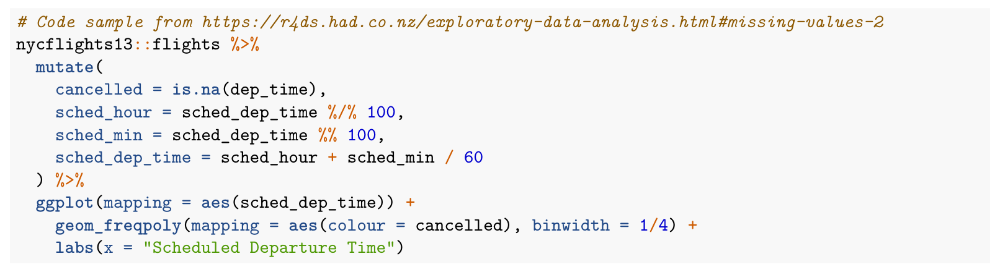
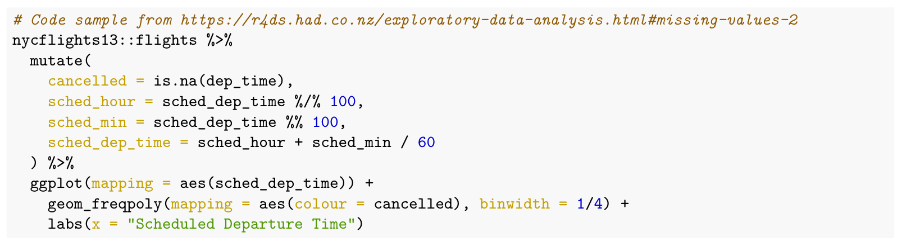

Old R Markdown Default Theme
================

Old R Markdown default theme for pdf documents.

## Usage

In the YAML header of the .Rmd file:

``` yml
output:
  pdf_document:
    pandoc_args: "--highlight-style=default.theme"
```

In the setup chunk of the .Rmd file:

``` r
.theme_url <- "https://raw.githubusercontent.com/mcgirjau/old-rmarkdown-theme/main/default.theme"
download.file(.theme_url, destfile = "default.theme")
```

Using `download.file` decreases local file dependencies. However, one
could also copy the
[default.theme](https://raw.githubusercontent.com/mcgirjau/old-rmarkdown-theme/main/default.theme)
file and place it in the same directory as the .Rmd (in which case
there’s no need for the setup chunk portion).

## Purpose

Using the old syntax highlighting defaults.

### Old Default Theme



### New Default Theme



## Useful Links

-   [Skylighting Tango
    Theme](https://hackage.haskell.org/package/skylighting-core-0.10.2/docs/src/Skylighting.Styles.html#tango)
-   [Pandoc Syntax Highlighting
    Examples](https://www.garrickadenbuie.com/blog/pandoc-syntax-highlighting-examples/)
-   [Creating Custom Pandoc Themes for R
    Markdown](https://community.rstudio.com/t/edit-tango-highlight/39106)
